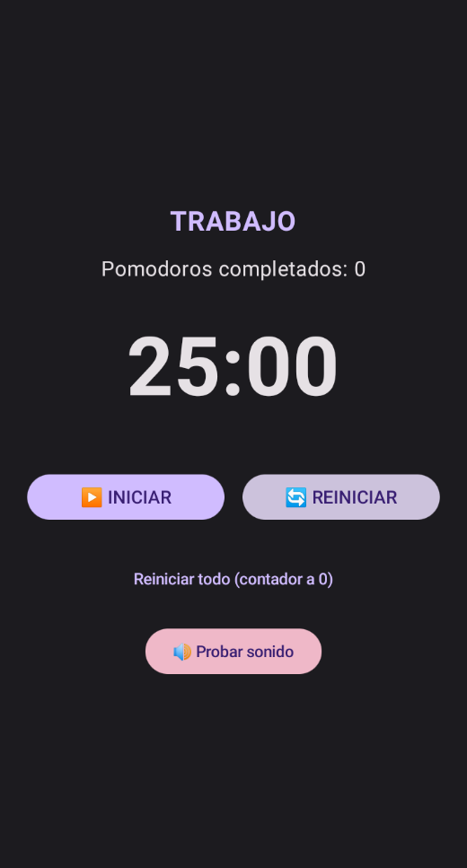

# PomodoroApp 🍅

Aplicación de temporizador Pomodoro desarrollada en Android con Kotlin y Jetpack Compose.  
**Este es el primer proyecto de** [Felipe Torres C.](https://github.com/Felipe-TC) y [Yanara Tranamil M.](https://github.com/yanaraluz),  
dando los primeros pasos para crear la marca **Huella Digital** 🇨🇱✨

---

## ✨ Características (v1.0)

- ⏱️ Temporizador de 25 minutos (trabajo)
- ☕ Descansos cortos (5 min) y largos (15 min)
- 🔁 Ciclos automáticos: 4 pomodoros → descanso largo
- 🔊 Sonido al finalizar cada período
- 📊 Contador de pomodoros completados
- 🎨 Interfaz minimalista y fácil de usar

---

## 📸 Capturas de pantalla



---

## 🚀 Cómo compilar y ejecutar

1. Clona el repositorio:
   ```bash
   git clone https://github.com/Felipe-TC/pomodoro-android.git
2. Abre el proyecto en **Android Studio** (última versión estable).
3. Conecta un dispositivo físico o inicia un emulador.
4. Ejecuta la app con el botón ▶️.

---

## 🛠️ Tecnologías utilizadas

- **Kotlin** - Lenguaje principal
- **Jetpack Compose** - UI declarativa
- **Material 3** - Diseño de componentes
- **Gradle** - Sistema de compilación

---

## 📄 Licencia

Este proyecto está bajo la licencia **MIT**.  
Ver archivo [LICENSE](LICENSE.txt) para más detalles.

---

## 👥 Equipo

- **Felipe Torres C.** - @Felipe-TC
- **Yanara Tranamil M.** - @yanaraluz  
*Desarrollado con ❤️ para el primer paso de **Huella Digital** 🚀*
